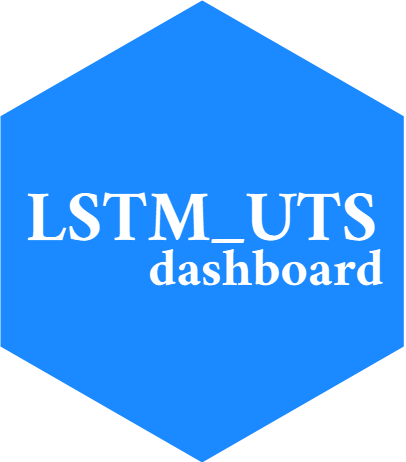
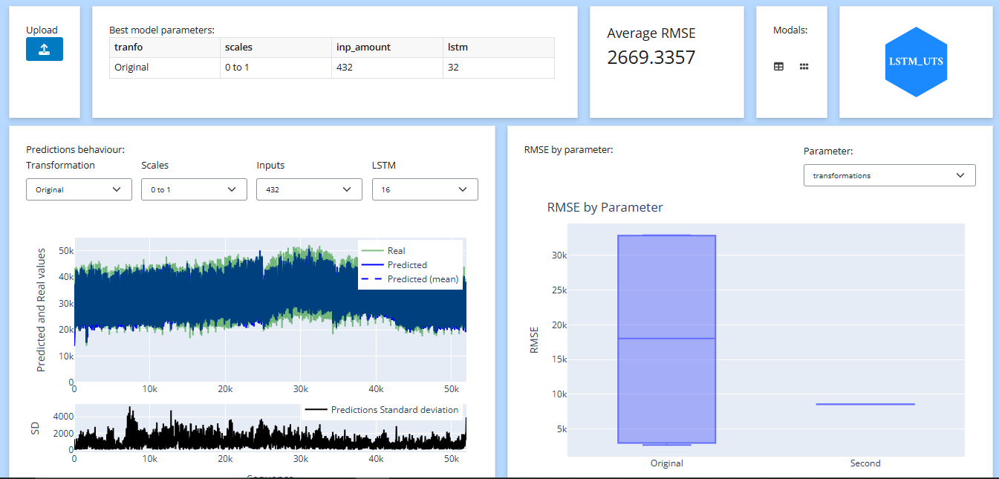
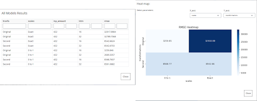

# lstm_uts_dashboard

 This repository contains the source of Simple implementation of LSTM networks for univariate time series forecasting analysis dashboard a web app made with python to easily analyze the results obtained form experimenting with my [LSTM_UTS application](https://0192def5-e80b-f2a8-66e3-12e608a87111.share.connect.posit.cloud/).

You can see the dependencies in the requirements.txt file

You can try this dashboard [here](https://davidrsch.github.io/lstm_uts_dashboard/)

**How to use it?**

Import a the .json file returned from the **LSTM_UTS** application using the first button to the left of the first row of the dashboard. And as result you will obtain the following dashboard.

Where you will see displayed at the second and third columns on the first row of the dashboard the parameters corresponding to the model that got the best RMSE and the obtained RMSE. In the second row you will find a first interactive graph to explore the behavior of the predictions obtained by the different models and a second interactive graph to explore the distribution of the RMSE obtained by all the models taking into account the different values of the models' parameters.

Additionally you can explore the results obtained by all the models using the first button to the left in the fourth column on the dashboard's first row as well as a model parameters' heatmap.

*Note:* The results displayed in the previously exposed images correspond to using the **LSTM_UTS** on the data available at [Electric Power Consumption](https://www.kaggle.com/datasets/fedesoriano/electric-power-consumption) using only the **PowerConcsumption_Zone1** historic observations to forecast future observations.